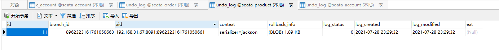
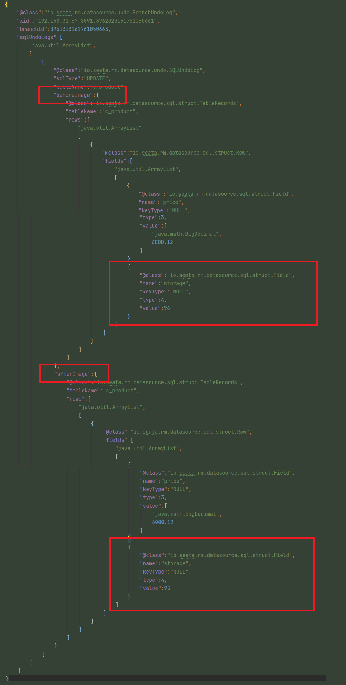

#### 参考
1、有兴趣其实可以直接看官方文档：https://seata.io/zh-cn/docs/overview/what-is-seata.html  
2、其他好文章：https://segmentfault.com/a/1190000038476525

#### 文字总结
````
Seata 使用2PC来管理全局事务  
1、第一阶段：开启各分支的事务
2、提交或回滚各个分支事务
````

#### Seata-第一阶段
````
1、首先要存在一个【事务协调器TC】（目前是 Seata-Server）

2、订单服务作为【事务管理器 TM】，因为有 @GlobalTransactional 注解，向 TC 发起开启全局事务的请求，并注册。

3、TC 会生成一个【事务ID XID】，然后返回给 TM。

4、订单服务启动订单数据库的【资源管理器 RM】，由 RM 向 TC 上报订单服务的执行情况，TC 根据执行情况判断是否回滚或提交。

5、TM 携带 XID，再调用账户服务。账户服务的 RM 会向 TC 申请注册，获取【分支事务ID BID】。

6、账户服务执行完后，向 TC 上报执行情况，TC 根据执行情况判断是否回滚或提交。

````

#### Seata-第二阶段
````
一、控制事务提交
````
1、TM 收集全部分支事务的状态，然后判断是否提交还是回滚  
2、如果是提交，那么 TM 向 TC 发起全局提交的请求。  
3、TC 向所有 RM 发起提交事务请求。  
4、全局事务提交完毕。

````
二、控制事务回滚
````
1、例如账户服务扣减余额失败，那么将执行情况上报给 TC。  
2、TC 收到后，发给 TM 进行决策。  
3、若回滚，那么 TM 告诉 TC 需要进行全局事务的回滚。  
4、TC 向所有 RM 发送回滚的指令。

#### Seata-undo_log表
````
1、在第一阶段的时候，Seata-server 会把新旧数据放到 undo_log 表，下面的 json 已删除部分信息

2、before_image 就是事务之前的数据，after_image 就是事务之后的数据

3、遇到需要回滚的事务，利用 undo_log 表的数据进行反向补偿
````



