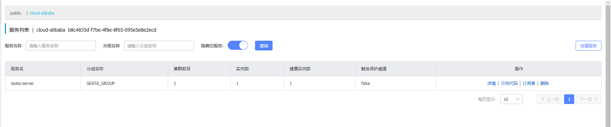

#### 一、下载 Seata 

https://seata.io/zh-cn/blog/download.html

#### 二、修改配置文件 registry.config
````
1、将 seata/config 的 registry.config，改成自己的 nacos 配置

2、不要傻傻地自己新建。

3、由于 nacos，所以不需要 file.config
````


#### 三、下载并导入到 Nacos 的配置 - config.txt
````
1、https://github.com/seata/seata/blob/develop/script/config-center/config.txt  

2、修改数据库: url、账号、密码；修改 store.mode = db  

3、将 config.txt 放到 nacos 的 config 文件夹  

4、下载 nacos-config.sh 文件：https://github.com/seata/seata/blob/develop/script/config-center/nacos/nacos-config.sh  

5、执行导入命令：sh nacos-config.sh -h localhost -p 8848 -g 命名的组名称 -t 命名空间id -u 账号 -w 密码

6、然后对应命名空间，就会多出很多 seata 配置
````


#### 四、启动 Seata
````
1、启动后，打开 nacos 控制台，会发现服务列表多了 seata-server 
````


