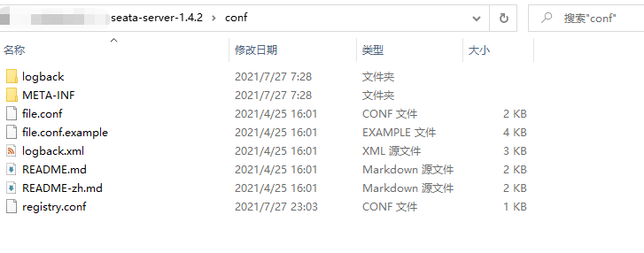
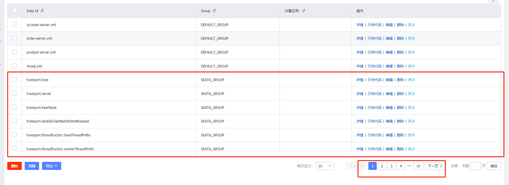

#### 一、下载 Seata 

https://seata.io/zh-cn/blog/download.html

#### 二、修改配置文件 registry.config
````
1、让 Seata-Server 注册到 Nacos。将 seata/config 的 registry.config，改成自己的 nacos 配置

2、将 seata事务组配置也放到每个模块的配置文件中。

3、由于 nacos，所以不需要 file.config
````


#### 三、下载并导入到 Nacos 的配置 - config.txt
````
1、https://github.com/seata/seata/blob/develop/script/config-center/config.txt  

2、修改数据库: url、账号、密码；修改 store.mode = db  

3、将 config.txt 放到 nacos 的 config 文件夹  

4、下载 nacos-config.sh 文件：https://github.com/seata/seata/blob/develop/script/config-center/nacos/nacos-config.sh  

5、执行导入命令：sh nacos-config.sh -h localhost -p 8848 -g 命名的组名称 -t 命名空间id -u 账号 -w 密码

6、然后对应命名空间，就会多出很多 seata 配置
````


#### 四、启动 Seata
````
1、启动后，打开 nacos 控制台，会发现服务列表多了 seata-server 
````


#### 五、添加 undo_log 
````
1、为 account、order、product 的数据库添加 undo_log 数据表

2、仓库地址：https://github.com/seata/seata/blob/develop/script/client/at/db/mysql.sql

3、不要以为 undo_log 没数据，是因为事务结束后，会异步删除里面的数据
````

#### 六、添加自动数据源代理
````
1、为开启全局事务的模块，在其启动类上，添加自动数据源代理配置
````

#### 注意：
````
1、若想要 nacos 自动读取配置，则需要把 nacos 文件名设置为 Application 所在的 artifactId。例：order-service.yml 

2、否则就需要在 application/bootstrap.yml 中，设置 extension-configs
````